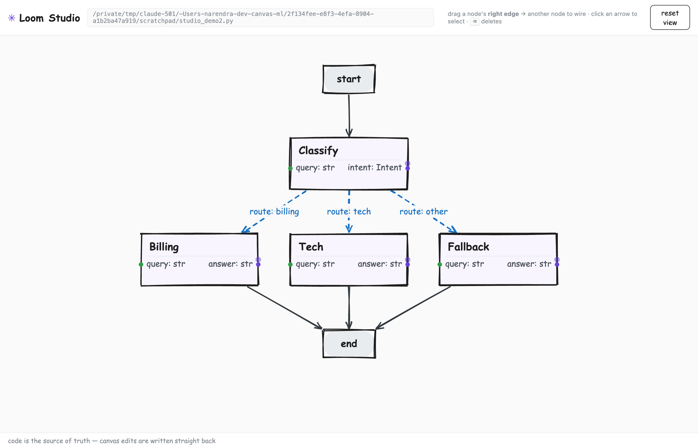

# Studio — the visual canvas

TensorSketch Studio is the **visual projection of your code**. It renders the graph a source file
defines and writes edits straight back into that file. There's no separate diagram to keep in
sync: the code is the source of truth, and the canvas is a lossless view of it.



> _A support router: `start → Classify`, a `route` conditional fanning out to `Billing` / `Tech`
> / `Fallback`, each converging on `end` — hand-drawn boxes, typed ports, dashed conditional
> arrows labelled with their routing key._

## Launch it

The Studio ships with the `canvas` extra (it's authoring-time tooling, kept out of the runtime):

```bash
pip install tensorsketch-core[canvas]
python -m tensorsketch.canvas examples/support_router.py
# → TensorSketch Studio → http://127.0.0.1:8765   (editing examples/support_router.py)
```

Open the printed URL. The little bridge is stdlib-only and binds to localhost — it's a developer
tool, not a service. It holds **no state of its own**: every load re-reads the file, every edit
re-writes it.

## What you see

- **Nodes** as hand-drawn boxes — the node's name, its typed **In** ports (green, left) and
  **Out** ports (violet, right). A node whose body is an unfilled `Hole` is tinted and dashed
  with a _needs code_ tag; the toolbar counts how many nodes still need code **across the whole
  project** — click it to list every hole (file, node, and its `Hole` message).
- **`start` / `end`** as pills.
- **Edges** — solid arrows for sequential edges; dashed blue arrows for conditional routes,
  labelled with the routing function and key (e.g. `route: billing`). A dynamic conditional with
  no static mapping shows a short `route → ?` stub, because its targets are decided at runtime.

The layout is computed automatically (a layered DAG), so the graph is readable without manual
arranging.

## Edit the graph

Every edit changes the **wiring** — never a node body — and is written back immediately by the
[code⇄canvas engine](../concepts/code-and-canvas.md):

- **Create a node** — click **+ node**, give it a name and (optionally) `In` / `Out` ports like
  `query: str, context: str`. Studio writes an idiomatic `class X(Node)` stub — a typed
  [hole](getting-started.md) — into your file and drops the node on the canvas, unwired. Fill its
  body in code; drag from its right edge to connect it.
- **Wire two nodes** — drag from a node's right edge onto another node. A sequential edge is
  added and the file is updated.
- **Move a node** — drag the node's body to arrange it. Position is presentation, not part of the
  graph, so it's saved to a sidecar (`‹file›.py.layout.json`) next to your code — never in it. A
  node you haven't moved uses the automatic layout; drop the sidecar and you lose only the
  arrangement.
- **Delete an edge** — click the arrow to select it, then press <kbd>⌫</kbd> / <kbd>Delete</kbd>.
- **Pan / zoom** — drag the background; scroll to zoom; _reset view_ reframes.

After each edit the canvas resyncs from the **re-extracted** code — so what you see is always
exactly what the file now says. Node bodies, imports, and comments are preserved untouched; only
the graph definition is rewritten, and it's rewritten in the **same authoring style you used**
(fluent chain, statement-style calls, or the `>>` operators) rather than collapsing to one form.

## Live trace overlay

Click **▶ live** in the toolbar to watch a run light up on the graph — each node ringed by its
status (green ok / red error) with a badge showing **latency · cost · call count**. It's the same
code⇄canvas idea applied to observability: a **read-only projection** of the run's spans onto the
nodes.

This works *without* Studio holding any run state — which is the whole point of a stateless
framework. Your agent runs in its **own** process and ships each finished span to the bridge; Studio
just polls and paints, the way Grafana reads your metrics. Wire it with the trace fan-out:

```python
from tensorsketch import MultiTracer, InMemoryTracer
from tensorsketch.observability.export import http_span_sink

tracer = MultiTracer(
    InMemoryTracer(),                                   # keep the trace for yourself, and…
    http_span_sink("http://127.0.0.1:8765/api/trace"),  # …feed the Studio overlay
)
await agent.invoke(inputs, tracer=tracer)               # nodes light up as spans arrive
```

The bridge buffers spans **in memory only** (a bounded live tail, gone when it stops) — the trace's
real home is whatever exporter you sent it to. The sink delivers on a background thread and drops
silently if Studio isn't running, so it never slows or breaks the run. Statelessness holds: Studio
*reads* your code and *reads* your telemetry, and owns neither.

## Just the aesthetic

The look — hand-drawn shapes, muted ink, a calm canvas — is borrowed from Excalidraw. Everything
else is TensorSketch: the blocks are typed nodes with real ports, the arrows are typed edges, and every
gesture round-trips through your code.

## Scope

Today the Studio renders any graph, creates nodes from a palette, moves them (positions persist in
a sidecar), adds/removes edges, and surfaces holes across the project — all through the round-trip,
and every rewrite preserves your authoring style (fluent / statement / `>>`). That completes the
code⇄canvas engine; see the [roadmap](../design/roadmap.md) for what's next.
